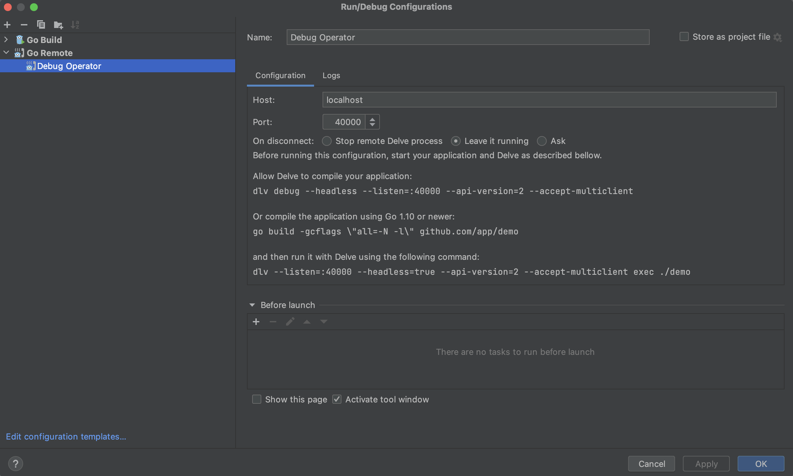

# Developing and testing Hazelcast Platform Operator

In this document, you will find the required information/steps to ease your contribution.

## Deploying the operator to Kubernetes

To deploy the operator from the source, you can run the command below:

```shell
make deploy IMG=hazelcast/hazelcast-platform-operator:latest
```

> Note: The operator is installed into the `default` namespace by default. You can pass `NAMESPACE` to `make` commands if you want to change it.

### Cleanup

To remove the operator from the Kubernetes cluster, run the following command:

```shell
make undeploy
```

## Development using Tilt

[Tilt](https://tilt.dev/) is used for quick code deployment in live containers. You can deploy the operator to a local K8s cluster and start developing by running the following command. 

```shell
tilt up
```

After you run the command you can go to the local development wep page. There, you will see the following resources.

- hazelcast-platform-operator-manager: Deployment for the operator. If you `trigger update`, it will rebuild the Docker image and restart the deployment. We added some buttons for easier development.
- operator:cancel: Adds cancel button for [local resources](https://docs.tilt.dev/api.html#api.local_resource) such as `run e2e-test` and `go-compile`.
- go-compile: If triggered, it builds the operator binary and triggers operator restart in the pod.
- run e2e-test in current namespace: It will run `make e2e-test` in the current context's namespace. You can stop it by pressing cancel button. if there are any leftover resources, you can delete them by pressing the `Delete CRs and PVCs` in `hazelcast-platform-controller-manager` resource. 
- uncategorized: Applies CRD and RBAC resources for the operator. Re-triggering it will delete and recreate mentioned resources. If re-triggered, operator pod needs to be restarted to work correctly.

### Debugging Using Tilt
Before starting to debug, be sure that Delve server is up and running on port 40000, you can check from the logs.

For local Kubernetes Clusters, use:
```shell
make tilt-debug
```

For remote Kubernetes Clusters, use:
```shell
make tilt-debug-remote-ttl
```

For VS Code users, add the following configuration:
```json
{
  "name": "Attach to Delve",
  "type": "go",
  "request": "attach",
  "mode": "remote",
  "port": 40000,
  "host": "127.0.0.1"
}
```

For Goland users:



### Using tilt with Remote Clusters

Tilt will not connect to remote clusters by default. If you want to use Tilt with any cluster, you can run one of the following commands

```shell
ALLOW_REMOTE=true tilt up
or
make tilt-remote
```

This will allow tilt to connect to cluster in its current context. However, if the cluster doesn't have a container registry, Tilt will not be able to push the operator image. You can use [ttl.sh](https://ttl.sh/) as the image registry by running the following command.

```shell
ALLOW_REMOTE=true USE_TTL_REG=true tilt up
or
make tilt-remote-ttl
```

## Running the operator locally

Hazelcast Platform Operator uses [hazelcast go-client](https://github.com/hazelcast/hazelcast-go-client) to connect to the cluster. For this reason, the pods need to be
exposed outside the cluster. Run the `make expose-local` command to expose Hazelcast member to `localhost:8000`.

The operator run must be built, with `build constraint` tag `localrun` and `hazelcastinternal`:

```shell
go build -o bin/manager -tags localrun,hazelcastinternal main.go
```

Or using `make` that will include the tag by default:

```shell
make install run
```

> Note: You can override the build tags in the `make` commands by setting `GO_BUILD_TAGS` env variable.

### Setting up build tags in GoLand

To run the operator from `GoLand`, execute the following steps to add build tags:

1. In GoLand Preferences, navigate to `Go | Build tags & Vendoring`
2. In the `Custom tags` field, enter `localrun hazelcastinternal`
3. Go to the `Run configuration` of the `Go build` select the `Use all custom build tags` checkbox

Now you can run the `main.go` using `GoLand`.

## Running Tests

There are different types of tests related to Hazelcast Platform Operator. 

### Running unit & integration tests

To run unit & integration tests, execute the following command.

```shell
make test
```

You can also run unit & integration tests separately by `make test-unit` and `make test-it` commands.

### Running end-to-end tests

You can run end-to-end tests by [deploying the operator to Kubernetes cluster](#deploying-the-operator-to-kubernetes). You could also [deploy the operator using Tilt](#development-using-tilt). 

```shell
make test-e2e NAMESPACE=<YOUR NAMESPACE>
```